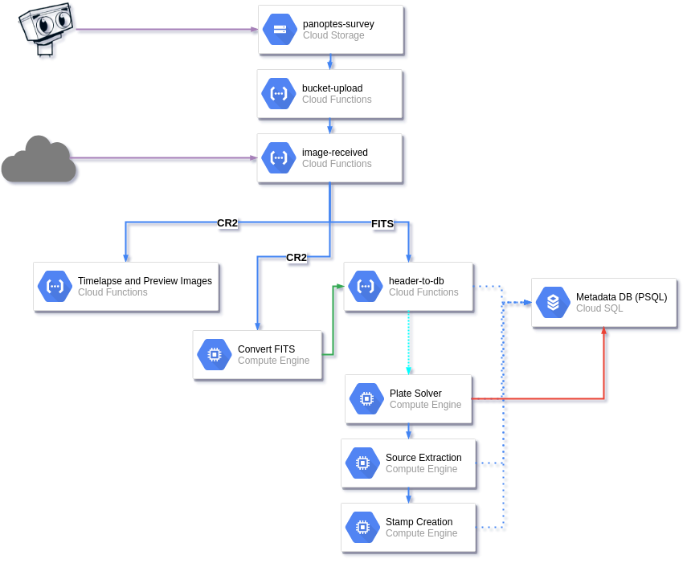

# PANOPTES Network

Software related to the wider PANOPTES network that ties the individual units together.
This is a repository to host the various Google Cloud Platform services.

Each subfolder defines a different service. Services communicate with each other
via [PubSub](https://cloud.google.com/pubsub/) messages. See the README for a
specific service for more details.

## Pipeline

Any file that is uploaded to the Google storage bucket will automatically trigger
a series of of basic cleaning and reduction steps to prepare for submitting to
the PANOPTES pipeline, as well as to make available for public consumption.

The services defined in this repo control the different "nodes" of the pipeline,
which is currently spread across a variety of technologies.



### Services

| Service                                    | Description |
|--------------------------------------------|--------------|
| [`record-image`](record-image/README.md)   |
| [`compress-fits`](compress-fits/README.md) |
| [`make-rgb-fits`](make-rgb-fits/README.md) |

#### Deploying services

You can deploy any service using `bin/deploy` from the top level directory. The
command takes the service name as a parameter:

```bash
$ bin/deploy record-image
```

##### Plate Solve & Source Extraction
**Service:** `gce-plate-solver`
[README](gce-plate-solver/README.md)

Listens for PubSub messages on the `gce-plate-solver` subscription and for each received
file will attempt to:

1. Download the image from the storage bucket.
2. Plate-solve the field with astrometry.net.
3. Upload newly solved file back to storage bucket.
4. Perform source extraction with `sextractor`.
5. Do a catalog match with the detected sources and the TESS catalog.
6. Generate data stamps for each of the detected and matched sources and add to Cloud SQL database.


## Todo

* On `image-received`:
    ✓ `fits.fz`:
        * forward to `record-image`
    ✓ `fits`:
        * fpack the file, delete original `gcp-fits-packer`
    * `cr2`:
        * extract the jpg
        * convert to raw fits
        ✓ forward to `cf-make-rgb-fits`
    * other: move to different bucket?

✓ On `cf-make-rgb-fits`:
    ✓ convert to 3 interpolated fits files for rgb
    ✓ uploaded fits files to `panoptes-rgb-images`

* On `record-image`:
    ✓ record image metadata in firestore.
    * Forward to `subtract-background`.

* On `subtract-background`:
    * subtract background.
        * save background to `panoptes-backgrounds`.
    * update image metadata.
    * forward to `plate-solve`.

* On `plate-solve`:
    * plate-solve.
        * save processed image to `panoptes-processed-images`.
    * update image metadata.


Todo regarding above:

* Process `fits` in `panoptes-raw-images`.
* Process `cr2` in `panoptes-raw-images`.

### Todo for export metadata observations:

* Find unsolved files in `panoptes-raw-images` and solve them.
    * Update `ra_image` and `dec_image` in images collection.
    * Change `status` to `solved`.

* Remove `camsn` from `images` collection.
* Remove `POINTING` keyword from `observations` with status `metadata_received`.

### Todo for processing:

* Add gaia dr2 id to document?


## With O & P:

* Extract `lookup_fits_header` from `cf-record-image` into separate cf.
* cf to update basic `observations` and `units` stats in firestore.
